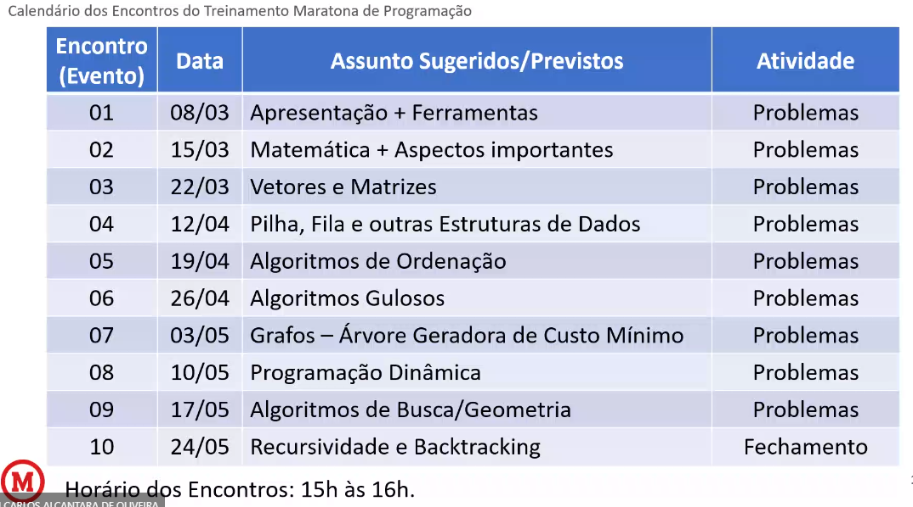

# Anotações dos Encontros - Treinamento Maratona de Programação

## Encontro 08/03/2023 - Introdução

- O programas são avaliados no sistema Ubuntu e diversas linguagens de programação são aceitas.
- 
- http://maratona.sbc.org.br/

## Encontro 15/03/2023 - Tipos de Problema no BeeCrowd

- *Compilation Error*: erros de sintaxe, basicamente, o programa não rodou.
- *Run time error*: erro no tempo de execução. O programa compilou, mas a execução demorou mais do que o ideal ou não alocou memória.
- *Wrong Answer*: o seu programa não responde corretamente ao exercício passado.
- *Presentation Error*: o programa está correto, mas a saída não está no formato especificado pela questão.
- *Time Limit Exceeded*: o programa demorou mais do que o permitido para executar.